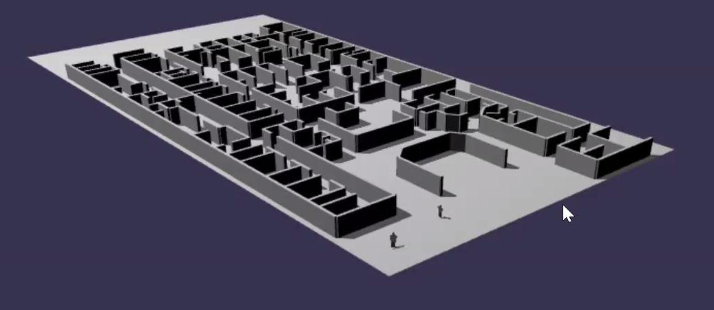

# MCARE

MCARE is a realistic hospital disaster simulation game on Hololens and Magic Leap in which doctors/players gain points for saving lives. 

## A Different Type of Gaming Experience

MCARE (Mass Casualty Augmented Reality Experience is a different kind of first-person shooter game. It doesn't shoot. MCARE is an Augmented Reality hospital disaster game on Hololens and Magic Leap in which players gain points for saving lives.

## UN WHO Academy

Developed by the UN World Health Organization Academy, MCARE is designed to enable doctors at hospitals worldwide to train in what to do during a mass casualty event, such as after a local earthquake or terrorist attack. Designed as a realistic medical simulation game, MCARE isn't only for doctors. WHO is building MCARE open source, so anyone may play.

## MCARE Games Producer

In 1995, as a navy research scientist, MCARE games producer Robin Rowe built the first realistic VR war game for training war fighters. That immersive war gaming simulation, a networked first-person shooter game running on millions of dollars worth of Silicon Graphics computers, sparked a multi-billion dollar industry of PC-based VR games that followed. Inspired games like Call of Duty.

## Timeline

Releasing in November 2021, MCARE is an open source AR game for anyone interested in gaming, medicine, AR or open source. An international MCARE development team is based in the United States, England, Portugal, France, Switzerland and the remote island of Mauritius.

## Documentation

* [MCARE Architecture and Roadmap](docs/mcare-architecture-roadmap.pdf)
* [Requirements](docs/mcare-requirements.md)
* MCARE UI
	* [Avatars and Login UI](docs/mcare-login-avatars.md)
	* [Checklist UI](docs/mcare-checklist.md)
	* [HUD UI](docs/mcare-hud.md)
	* [Headsets](docs/mcare-headset-makers.md)
	* [Player Setup](docs/mcare-setup.md)
	* [Spatial Audio](docs/mcare-spatial-audio.md)
	* [Translation](docs/mcare-translation.md)
	* [Settings and Game Flow](docs/mcare-settings-flow.pdf)
* [Behaviorial Science](docs/mcare-behavioral-science.md)
* [Card Game Version](docs/mcare-card-game-requirements.md)
* [Engagement Metrics](docs/mcare-engagement-metrics.md)
* [Features Wish List](docs/mcare-ar-wish-list.md)
* [Inspiration from Hollywood](docs/mcare-hollywood.md)
* [Metrics](docs/mcare-metrics.md)
* [Original Concept](docs/mcare-ar-concept.md)

* [Git How-to](docs/git-how-to.md)
