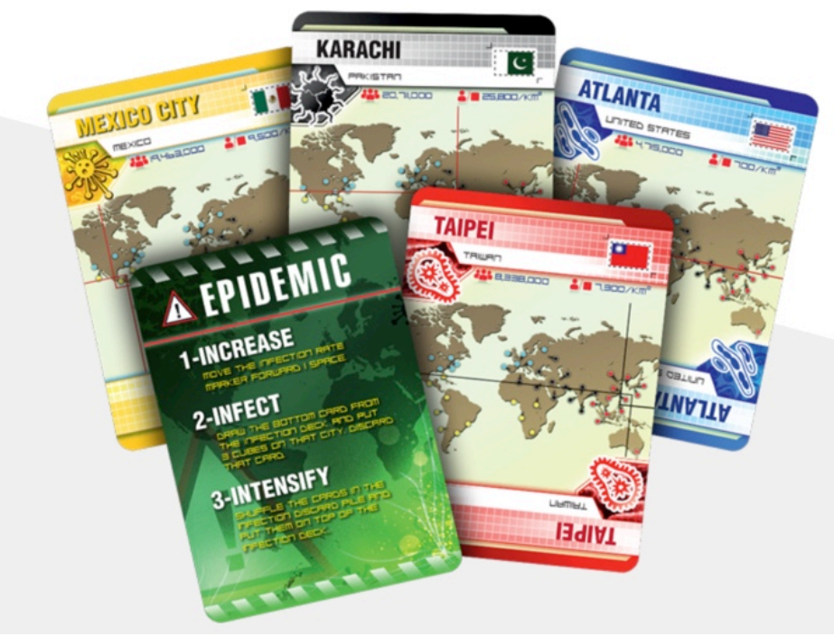

# MCARE Card Game Requirements

## 1 Player Roles

* Incident Commander
* Clinical Lead
* Resource Lead
* Triage Officer
* Red Zone Emergency Responder
* Green Zone Emergency Responder

### Q1.1: Do all roles need to be used? What if we have fewer or more than six players?

* Full game: 8+ players, extra players added to Red or Green teams evenly
* Regular game: 4 players, at least 2 Red Team and 2 Green Team players
* Solo game: 1 player like solitaire
* Autonomous game: Computer simulation iwht 0 human players, all players AI bots

The House plays the cards of non-existent players. Cards that require a player make a choice are played by the House using dice. If a throw of the first die comes up with a number that is not a valid choice (for example, #6 for a card that only has 4 action choices) another throw is tried using the second die. If both tries fail, the card is not played now, but placed under the bottom of the draw deck.

### Q1.2: What are the attributes of each role? What are their unique abilities?

Modeled on the real-world capabilities of each role.

### Q1.3: How many cases should the team solve?

The game setting is regional. Could there be an epidemic, an earthquake and a tsunami at the same time in the same region? Yes. Is that likely? No. The game should model reality. Black swans are possible but rare, like a straight or a flush in poker.

## 2. The game is both cooperative and competitive

### Q2.1: How will the cooperative and competitive elements be balanced?

Team members communally share chips, win or lose together. However, each player holds own stack so everyone can see how a player is doing individually. Teams are a partnership. Team must cover any teammate busted by giving chips to prevent player going negative. As long as any member of a team has chips, entire team is still in the game.

### Q2.2: How will we keep score?

Points are always calculated as MoLA, Minutes of Life Added to patient(s). The points awarded/deducted for each event response are labeled on the backs of the cards.

### Q2.3: How will the winner be determined?

When the game is over the team with the most points wins. The individual player holding the most chips on the winning team is the **Hero of MCARE**.

## 3 Card Types

* Role Cards
* Event Cards
* Case Cards

A player's role in the game is determined by drawing from a short deck of role cards. Players may horse trade, that is, swap roles, only if unanimously agreed as a rule beforehand.

### Q 3.1 Who collects/earns the case once it is solved?

Per the points on the back of the card.

### Q3.2 Can players earn points for both helping to solve a case and helping others solve a case?

Yes, because a team’s points are held as in partnership.

### Q3.3 Does the whole team move forward together but individually need to make decisions?

Yes, like *Family Feud*, other members of the team may make suggestions if that rule is unanimously agreed by the players at the beginning of the game. If not, there is no helping or coaching, no lifelines for struggling players. 

### Q3.4 What is the penalty for not solving a case?

Points defined per the case card.

## 4 Player Abilities

### Q4.1 What are the individual role abilities?

TBD.

### Q4.2 What are the types of actions and resources cards we need?

TBD.

### Q4.3 What types of special actions can players take? What balance of cards do we need?

TBD.

### Q4.4 How many cases do players need to solve to win?

Whichever team has the most points at the end of the game wins. A tie goes into sudden death overtime. Play continuing until at the end of a round when it is no longer a tie. A round is defined as each player having gotten one play.

### Q4.5 How many action and resources cards should players get?

TBD. Assume 52-card deck.

## 5 Cases

### Q5.1: What if they don’t solve a case?

Based on chance, the game may present scenarios that are unwinnable. 

### Q5.2: How do we know how many points a player has? 

* Points are held like poker chips, with the value of each color of chip defined and labeled. Points are awarded or taken away from each player based on event response actions. Each choice has a different positive or negative value. Like poker, each player starts with a stack of chips. May be required to ante or bet as directed by cards. 
* House Bets: A player choosing to place a bet against the House can play for double-or-nothing of whatever is bet. The House Bet is placed upon picking a card but before hearing the multiple choices. Picking a successful action doubles the amount bet, is paid by the House. A losing action loses the bet to House. The player additionally wins or loses the amount as directed by the card. The House Bet is independent.
* Side Bets: Any player may side-bet with any opposing team player who agrees to it. A player is allowed to Sacrifice, to deliberately chose a wrong answer to cause another player to lose a Side Bet. However, the Sacrifice must pay the penalty per the card. A player wishing to throw off a Side Bet may have a strategy to choose the least losing answer, so as to lose less. An answer with +1 or -1 points is sufficient to determine a Side Bet. Side bets are won or lost based upon the player playing the card gaining or losing points.

### Q5.3: How are we scoring the helping behaviors?

On the front of the card is a description of the event. On the back of each card are the choices and scores for each action. It's a multiple choice quiz. 

The opposing team draws the card and reads the multiple choices aloud for the player to choose. The opponent reading the card can see the potential points, but the player cannot. Once the player has made a choice, the opponent flips the card over and the player receives/deducts the points per the card. Like *Who Wants to Be a Millionaire*. 

### Q5.4: What is the balance between chance and skill?

Like Texas Hold’em poker.

## 6 Duration and Rulebook

### Q6.1 When is the game over?

* The game may be resource-limited like archery, until out of arrows. That is, no more cards in the draw deck. 
* The game may be timed Like basketball, that a game may be 48 minutes. In timed play, there may be two decks, with each team drawing from its own deck and working as quickly and accurately as possible. That time counts, like *Family Feud*.
* There may be tournaments.

### Q6.2 What should be the format of the rulebook?

Example https://official.nba.com/rulebook/
