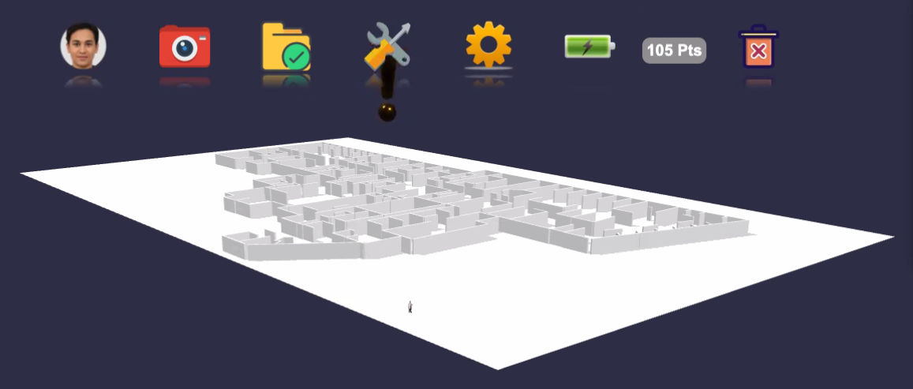

# MCARE System Set-up

by Robin Rowe 2021/07/22

MCARE AR glasses operation is multi-modal with MCARE mobile app.

## MCARE Installation

1. Install MCARE multi-modal mobile app on phone (iOS or Android)
1. Install MCARE AR game app on glasses 

## MCARE Log-in

1. Launch MCARE app
1. Log into app
1. Take selfie in app
1. Ask player which model of AR glasses: Magic Leap, Hololens, Jedi, None?
1. App says: "Put on AR glasses"
1. Player confirms "Ok"
1. App displays log-in QR code
1. Glasses read mobile app QR or physical badge QR/barcode
1. Log in player, if no network, attempt local log in
1. Set language to language of player
1. If network, network speed test
1. If new player, both apps ask, Perform Set-up?

## MCASE Set-up: Audio

1. Test player's speakers, adjust volume
1. Test player's hearing
1. Offer to set to mono if deaf in one ear
1. Test player's microphone, adjust volume
1. Offer to play 90-second intro video (MCARE trailer)

## MCARE Setup: Gesture

1. Test player for color blindness
1. Test gesture with simple tasks

## MCARE Setup: Gaze

1. Test gaze with simple tasks

## MCARE Setup: Speech IVR

Ask player to speak list of 32 IVR action words.

1. Yes, No
1. Up, Down
1. Back, Next
1. Go, Stop
1. Left, Right
1. In, Out
1. On, Off
1. Cut, Copy, Paste
1. More, Less, All
1. Take, Select
1. 1, 2, 3, 4, 5, 6, 7, 8, 9, 0

After Set-up, player enters AR Lobby or may rejoin previous game.

---
