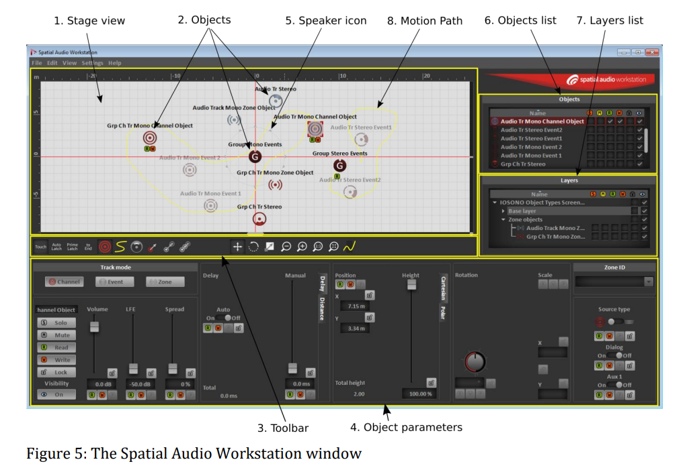

# MCARE Spatial Audio

by Robin Rowe 2021/6/28, 2021/10/6

_What is our thinking in relation to audio in the game, in terms of how the procedural and spatial aspects will be handled?_

The fundamental concept is every sound has a location in 3D space. 

## IOSONO 380-channel Spatial Sound System

To support theatrical spatial sound, 380 speakers were installed at Mann's Chinese:

https://www.livedesignonline.com/electrosonic-installs-380-channel-iosono-audio-system-at-mann-chinese-6-theatre-hollywood

The software to support this is from Encircled:

https://encircled-audio.com/

The production plugin:

https://encircled-audio.com/static/saw_user_manual_2.4.3-cc1b67153274c06485559c4853528f3d.pdf

We are not using the Nuendo SAW, but their manual is interesting as a spatial audio system that has a manual, that shows what spatial sound placement looks like in a DAW. 

Instead of Nuendo SAW, we are building our own software to operate for spatial sound placement. For spatial audio production, we will place many sound point sources at locations in stage space. Our stage is a 3D x-y-z space, a hospital with multiple floors.

## Game Spatial Audio

Unlike IOSONO, we aren't producing for 380 speakers at Mann's Chinese. Software in the headset will render a unique 3D audio experience to each player. For playing to the headset, there is no LT/RT, no Dolby 5.1, no mixing stage, because baking those mixes presumes a fixed head position. Spatial audio mixes autonomously to match each player's head in real time. 

Our spatial audio AR software will ride audio mix levels in real time, based on the player's head position relative to the point sources you define. Think of the mix changing autonomously like automation of sliders on a mixing board. But not from a predefined setting as for a room mix. An individual audio mix headset experience optimal to each listener based on where their heads are at any moment in real time calculated by computer software.

## Head-spinning Spatial Audio

In a room with speakers, when a person's head turns, the speakers stay in place. A speaker to our right or left is still where it was no matter where we turn. When wearing a headset playing an LT/RT or 5.1 mix, the room spins as our head moves. With a conventional headset, turning our head 180 degrees does not swap ears LT/RT. With spatial audio, turning our head 180 degrees does swap channels. Point sources stay where they belong no matter where we turn our heads. If a person to our side is speaking, and we turn our head to hear them better, that works the same in the AR world as in the real world.

## Foreign Language Support, No Dubbing

We won't need some expensive audio plugin to match duration or match the movement of lips to a foreign language. We control the animation on an individual basis. Match the lips to the words, not the other way around. Every player has an individual viewing and listening experience, sees in effect a slightly different version of the same movie. 

If we are working from Korean to English, as was done recently for some Korean cartoons, we will make the animated lips match the English audio. Will not call in any superhero VO actors to speak English words that have the same lipsync as in the Korean animation. 

## Machinima

In machinima real-tme animation we control everything. Can change anything, live. We don't need the clever tricks that are used to dub one film to make it seem shot in multiple languages. We can make our animation be in 26 dialects, or however many different language versions we wish, without a problem with lipsync. Because each version renders a different lipsync that matches the language being spoken.

See this machinima clip from *Call of Duty*:

https://vimeo.com/24471494

Note that the live performer being motion-captured on the sound stage at Moves has avatar lipsync that matches whatever he says. Instead of matching the words to his lips, his avatar's animated. This happens in real-time, at 120 fps, without human animators. Animated by computer.

## Dolby Atmos

Dolby Atmos is considered the state of the art today:

* [Dolby Developer](https://developer.dolby.com/platforms/html5/overview/)

* [Dolby Atmos in Games](https://www.pocket-lint.com/games/news/dolby/141761-dolby-atmos-for-gaming-what-is-it-and-what-games-support-it)

## Spatial Audio Research

The original research in gaming spatial audio was done at NPSNET, when I was on the dev team there in the mid-1990s. Might find something useful there on spatial audio theory:

* [Headphone-delivered three dimensional sound in NPSNET](https://calhoun.nps.edu/handle/10945/32217)
* [NPSNET: aural cues for virtual world immersion](https://calhoun.nps.edu/handle/10945/23731)
* [Free field spatialized aural cues for synthetic environments](https://calhoun.nps.edu/handle/10945/43018)

## Hello World

A first step is to create a 'Hello World' spatial audio app, with a point-source sound that a user can walk around and sense the sound is staying put as the user moves. As a temp track we can record, "Paging Doctor Olim. Dr. Olim to Triage stat." Play that in a loop with ourselves as an NPC avatar in the room. The room having 4 walls and in the middle of the room there's a speaker (a box, not a person). We as the avatar travling in an orbit around the speaker.

While our target platform is WebAudio, a UWP implementation would be nice to have as well, to hear if it sounds identical.

Hello World is only a simple test app. Once we have that done, we can create a separate app that has a hospital reception room and an operating theater room.

## Hello World Test Server

A simple, manually operated, test server that for UI has a web cgi form. Create a plain web form using http://www.phpform.org/ or whatever. Form will interface with a websocket server we build. Maybe Apache cgi-bin or node.js or ???

Web form has a FromId field (int), a ToId field (int), a 2-letter command code field, a text payload field and a Submit button. Data collected from form is sent down a websocket on port 8080 to the HelloWorld app. 

### Links

[3D Audio Basics[(https://youtu.be/K9wlZveOw_M)
[Ambisonics 3D audio in Pro Tools](https://youtu.be/p7olXJuE9_w)
[Apple Spatial Audio](https://www.makeuseof.com/what-is-spatial-audio/)
[3D audio on headphones](https://www.waves.com/nx)
[with optional head-tracker](https://www.waves.com/hardware/nx-head-tracker)
[Room EQ](https://www.roomeqwizard.com/)
